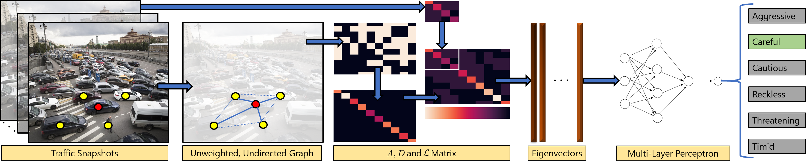

# GraphRQI
Codebase for our ICRA 2020 submission, [**GraphRQI: Classifying Driver Behaviors Using Graph Spectrums**](https://gamma.umd.edu/graphrqi). 
Rohan Chandra, Uttaran Bhattacharya, Trisha Mittal, Xiaoyu Li, Aniket Bera, Dinesh Manocha.

Instructions coming soon.

